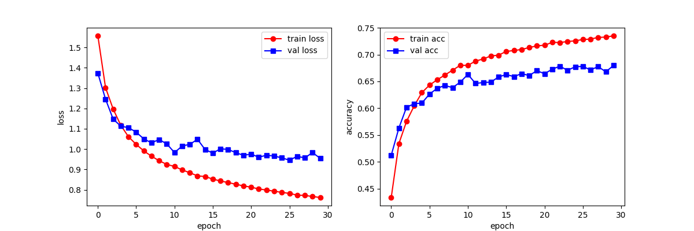
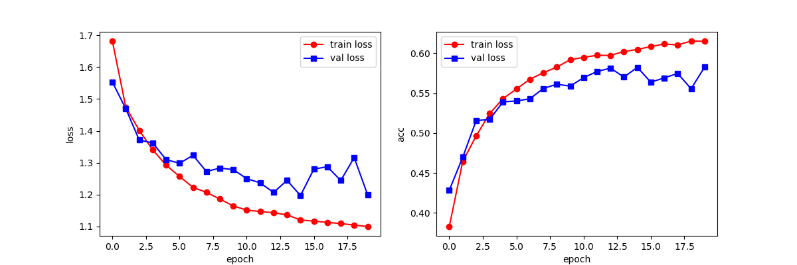
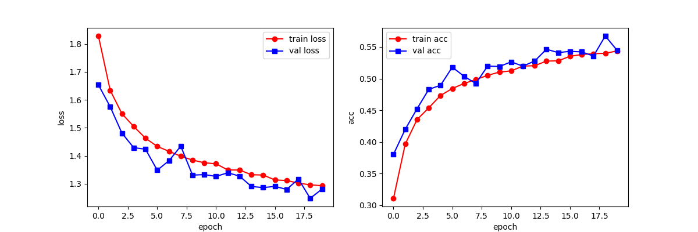

# 训练日志
## 初代测试

准确率:0.3605，相当的低

## 第一次修改：增加对数据集的随机翻转、裁剪
* transform = transforms.Compose([
        transforms.Resize(size=32),  
        transforms.ToTensor(),
        transforms.Normalize(mean=[0.5, 0.5, 0.5], std=[0.5, 0.5, 0.5])
    ])

准确率:0.2888，不增反降
（但不排除减少训练轮次的影响）

## 第二次修改：随机丢失一部分神经元
* self.dropout = nn.Dropout(0.5)

准确率： 0.2554，观察图像发现并未过拟合，考虑增加训练轮次

## 第三次修改：增加训练轮次

# 存在问题
在使用Intel Pytorch Extension时，出现报错：
* Traceback (most recent call last):
  File "D:\Comsen\CIFAR10ClassificationPrediction\test.py", line 152, in <module>
    train_ch6(net, train_loader, test_loader, num_epochs, lr, device)
  File "D:\Comsen\CIFAR10ClassificationPrediction\test.py", line 102, in train_ch6
    epoch_train_correct += (predicted == y).sum().item()
RuntimeError: UR error

初步判断为Intel Pytorch Extension支持的Pytorch版本问题，故目前本题只能使用CPU训练

* C:\Users\*****\.conda\envs\mytorchgpu3.
  9\lib\site-packages\torchvision\io\image.py:14: UserWarning: Failed to 
  load image Python extension: 'Could not find module 'C:\Users\*****\.
  conda\envs\mytorchgpu3.9\Lib\site-packages\torchvision\image.pyd' (or one of its dependencies). Try using the full path with constructor syntax.'If you don't plan on using image functionality from `torchvision.io`, you can ignore this warning. Otherwise, there might be something wrong with your environment. Did you have `libjpeg` or `libpng` installed before building `torchvision` from source?
  warn(

Intel Pytorch  Extension所支持的torchvision版本也存在一定问题